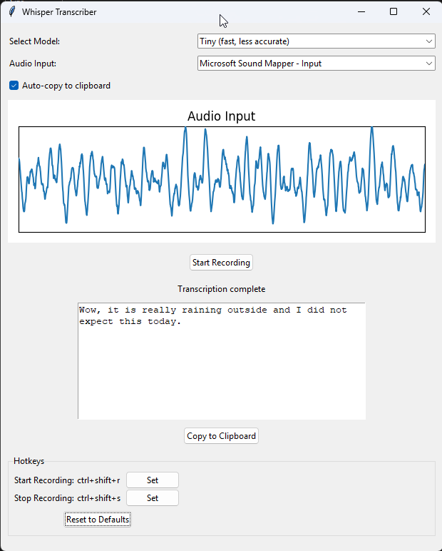
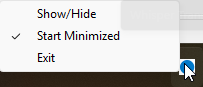

# local-audio-to-text
A python gui interface built around the whisper transcription allows you to start/stop audio recording and automatically copies to clipboard when complete. Configurable hot keys, ability to import audio files and videos (videos seems broken atm).

## To-Do List

- [ ] Figure out why video doesn't work
- [ ] Make script add to startup?
- [ ] Move python to separate files

# Main program

# Task Tray

# Not Recording Icon

# Processing Recording Icon

# Recording Icon

