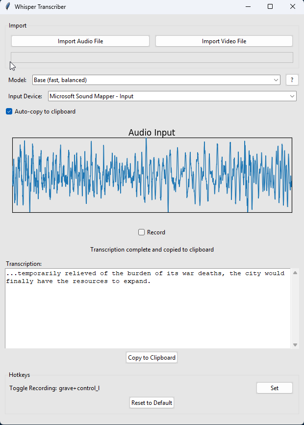

# local-audio-to-text
A python gui interface built around the whisper transcription allows you to start/stop audio recording and automatically copies to clipboard when complete. Configurable hot keys, ability to import audio files and videos (videos seems broken atm).


## To-Do List

- [ ] Figure out why video doesn't work
- [ ] Make script add to startup?
- [ ] Move python to separate files

# Setting Up the Virtual Environment and Installing Dependencies

# Project Setup Guide

## Setting up a Virtual Environment

### Prerequisites
- Python 3.x installed on your system
- pip (Python package installer)

### Create and Activate Virtual Environment

#### On Windows
```bash
# Create virtual environment
python -m venv venv

# Activate virtual environment
venv\Scripts\activate
```


# Mac/Linux
```bash
# Create virtual environment
python3 -m venv venv

# Activate virtual environment
source venv/bin/activate
```


# Install Requirements
```bash
Once the virtual environment is activated, install the project dependencies:

pip install -r requirements.txt

deactivate
```


# Main program


# Task Tray


# Not Recording Icon


# Processing Recording Icon


# Recording Icon

